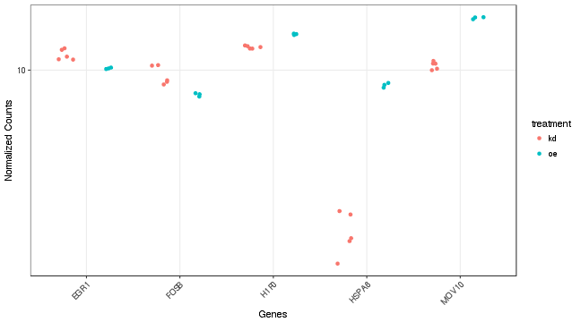

 


Load packages


```r
> .void = lapply(list("dplyr", "tidyr", "ggplot2", "DESeq2", "DEGreport"), require, 
+     character.only = TRUE)
```

load example from our teaching team at Harvard Chan School


```r
> count = read.delim("Mov10_full_counts.txt", sep = "\t", row.names = 1)
> meta = data.frame(row.names = colnames(count), name = colnames(count)) %>% separate(name, 
+     sep = "_", into = c("type", "condition", "rep"))
> 
> library(DESeq2)
> dds = DESeqDataSetFromMatrix(count, meta, design = ~type + condition)
> dds = DESeq(dds)
> 
> res = results(dds)
> res$id = row.names(res)  # add gene name for plotting
> res = res[order(res$padj), ]  # sort by padj
> 
> norm_counts = assay(rlog(dds))  # normalize counts
```

Make some nice plots:


```r
> DEGreport::degPlot(dds = dds, res = res, n=9, xs="type", group = "condition")
```


```r
> pattern = DEGreport::degPatterns(norm_counts[row.names(res)[1:500],], # norm counts
+                                  meta, # design
+                                  time = "type", col = "condition") # plot settings
```


Working with  500  genes 


 Working with  494 genes after filtering: minc >  15 



```r
> DEGreport::degVolcano(
+     as.data.frame(res[,c("log2FoldChange","padj")]), # table - 2 columns
+     plot_text=as.data.frame(res[1:10,c("log2FoldChange","padj","id")])) # table to add names
```


