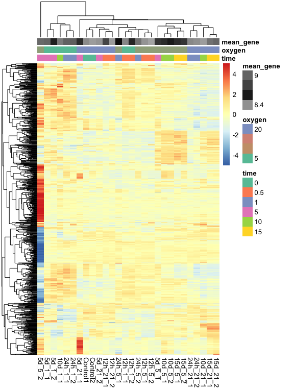

This post will show how to configure quickly the colors for the annotation of rows/columns that go on top or on the side of a heatmap.

I normally use `pheatmap` a lot. Recently I discovered `ComplexHeatmap`. In both cases I spend always sometime changing the colors of the annotations. I ended up coding a function inside my package `DEGreport` to do that.

Given a data.frame with metadata data information will do:

-   white-black scale for numerical variables
-   blue-orange for categorical values with only two categories
-   `Set2` palette for categorical values with more than two categories

All three color sets can be changed using the [parameters function](http://lpantano.github.io/DEGreport/reference/degColors.html).

``` r
library(DEGreport)
library(stemHypoxia)
data(stemHypoxia)
```

I am going to use this [stemcell experiment dataset](https://bioconductor.org/packages/release/data/experiment/html/stemHypoxia.html) I found randomly in Bioconductor page.

``` r
exp = as.matrix(M[,3:30])
rownames(exp) = M[,2]
rownames(design) = colnames(exp)
design = design[,c(1:2)]
design$time = as.factor(design$time)
```

I'll find the most variable genes.

``` r
most_variable = names(tail(sort(apply(exp, 1, sd)), 1000))
design$mean_gene = colMeans(exp[most_variable,])
```

And we can plot the heatmap with new colors with need to specify each variable at a time.

``` r
library(pheatmap)
pheatmap(exp[most_variable,], scale = "row", show_rownames = FALSE,
         annotation_col = design,
         annotation_colors = degColors(design))
```



If you use `ComplexHeatmap` you can activate `col_fun = TRUE` to get it working.

-   R Session

``` r
devtools::session_info()
```

    ## Warning: 'DESCRIPTION' file has an 'Encoding' field and re-encoding is not
    ## possible

    ## Session info -------------------------------------------------------------

    ##  setting  value                       
    ##  version  R version 3.5.1 (2018-07-02)
    ##  system   x86_64, darwin15.6.0        
    ##  ui       X11                         
    ##  language (EN)                        
    ##  collate  en_US.UTF-8                 
    ##  tz       America/New_York            
    ##  date     2018-09-21

    ## Packages -----------------------------------------------------------------

    ##  package              * version   date       source                       
    ##  acepack                1.4.1     2016-10-29 cran (@1.4.1)                
    ##  annotate               1.58.0    2018-05-01 cran (@1.58.0)               
    ##  AnnotationDbi          1.42.1    2018-05-08 Bioconductor                 
    ##  assertthat             0.2.0     2017-04-11 CRAN (R 3.5.0)               
    ##  backports              1.1.2     2017-12-13 CRAN (R 3.5.0)               
    ##  base                 * 3.5.1     2018-07-05 local                        
    ##  base64enc              0.1-3     2015-07-28 CRAN (R 3.5.0)               
    ##  bindr                  0.1.1     2018-03-13 CRAN (R 3.5.0)               
    ##  bindrcpp               0.2.2     2018-03-29 CRAN (R 3.5.0)               
    ##  Biobase                2.40.0    2018-05-01 Bioconductor                 
    ##  BiocGenerics           0.26.0    2018-05-01 Bioconductor                 
    ##  BiocParallel           1.14.2    2018-07-08 cran (@1.14.2)               
    ##  bit                    1.1-14    2018-05-29 CRAN (R 3.5.0)               
    ##  bit64                  0.9-7     2017-05-08 CRAN (R 3.5.0)               
    ##  bitops                 1.0-6     2013-08-17 cran (@1.0-6)                
    ##  blob                   1.1.1     2018-03-25 CRAN (R 3.5.0)               
    ##  broom                  0.5.0     2018-07-17 CRAN (R 3.5.0)               
    ##  checkmate              1.8.5     2017-10-24 cran (@1.8.5)                
    ##  circlize               0.4.4     2018-06-10 cran (@0.4.4)                
    ##  cluster                2.0.7-1   2018-04-13 CRAN (R 3.5.1)               
    ##  colorspace             1.3-2     2016-12-14 CRAN (R 3.5.0)               
    ##  compiler               3.5.1     2018-07-05 local                        
    ##  ComplexHeatmap         1.18.1    2018-06-19 cran (@1.18.1)               
    ##  ConsensusClusterPlus   1.44.0    2018-05-01 cran (@1.44.0)               
    ##  cowplot                0.9.3     2018-07-15 cran (@0.9.3)                
    ##  crayon                 1.3.4     2017-09-16 CRAN (R 3.5.0)               
    ##  data.table             1.11.4    2018-05-27 cran (@1.11.4)               
    ##  datasets             * 3.5.1     2018-07-05 local                        
    ##  DBI                    1.0.0     2018-05-02 CRAN (R 3.5.0)               
    ##  DEGreport            * 1.17.5    2018-09-04 local (lpantano/DEGreport@NA)
    ##  DelayedArray           0.6.5     2018-08-15 cran (@0.6.5)                
    ##  DESeq2                 1.20.0    2018-05-01 Bioconductor                 
    ##  devtools               1.13.6    2018-06-27 CRAN (R 3.5.0)               
    ##  digest                 0.6.16    2018-08-22 CRAN (R 3.5.0)               
    ##  dplyr                  0.7.6     2018-06-29 CRAN (R 3.5.1)               
    ##  edgeR                  3.22.3    2018-06-21 cran (@3.22.3)               
    ##  evaluate               0.11      2018-07-17 CRAN (R 3.5.0)               
    ##  foreign                0.8-71    2018-07-20 CRAN (R 3.5.0)               
    ##  Formula                1.2-3     2018-05-03 cran (@1.2-3)                
    ##  genefilter             1.62.0    2018-05-01 cran (@1.62.0)               
    ##  geneplotter            1.58.0    2018-05-01 cran (@1.58.0)               
    ##  GenomeInfoDb           1.16.0    2018-05-01 cran (@1.16.0)               
    ##  GenomeInfoDbData       1.1.0     2018-08-31 Bioconductor                 
    ##  GenomicRanges          1.32.6    2018-07-20 cran (@1.32.6)               
    ##  GetoptLong             0.1.7     2018-06-10 cran (@0.1.7)                
    ##  ggdendro               0.1-20    2016-04-27 cran (@0.1-20)               
    ##  ggplot2                3.0.0     2018-07-03 CRAN (R 3.5.0)               
    ##  ggrepel                0.8.0     2018-05-09 cran (@0.8.0)                
    ##  GlobalOptions          0.1.0     2018-06-09 cran (@0.1.0)                
    ##  glue                   1.3.0     2018-07-17 CRAN (R 3.5.0)               
    ##  graphics             * 3.5.1     2018-07-05 local                        
    ##  grDevices            * 3.5.1     2018-07-05 local                        
    ##  grid                   3.5.1     2018-07-05 local                        
    ##  gridExtra              2.3       2017-09-09 cran (@2.3)                  
    ##  gtable                 0.2.0     2016-02-26 CRAN (R 3.5.0)               
    ##  Hmisc                  4.1-1     2018-01-03 cran (@4.1-1)                
    ##  htmlTable              1.12      2018-05-26 cran (@1.12)                 
    ##  htmltools              0.3.6     2017-04-28 CRAN (R 3.5.0)               
    ##  htmlwidgets            1.2       2018-04-19 cran (@1.2)                  
    ##  IRanges                2.14.11   2018-08-24 Bioconductor                 
    ##  knitr                  1.20      2018-02-20 CRAN (R 3.5.0)               
    ##  lasso2                 1.2-19    2014-05-31 cran (@1.2-19)               
    ##  lattice                0.20-35   2017-03-25 CRAN (R 3.5.1)               
    ##  latticeExtra           0.6-28    2016-02-09 cran (@0.6-28)               
    ##  lazyeval               0.2.1     2017-10-29 CRAN (R 3.5.0)               
    ##  limma                  3.36.3    2018-08-25 cran (@3.36.3)               
    ##  locfit                 1.5-9.1   2013-04-20 cran (@1.5-9.1)              
    ##  logging                0.7-103   2013-04-12 cran (@0.7-103)              
    ##  magrittr               1.5       2014-11-22 CRAN (R 3.5.0)               
    ##  MASS                   7.3-50    2018-04-30 CRAN (R 3.5.1)               
    ##  Matrix                 1.2-14    2018-04-13 CRAN (R 3.5.1)               
    ##  matrixStats            0.54.0    2018-07-23 cran (@0.54.0)               
    ##  memoise                1.1.0     2017-04-21 CRAN (R 3.5.0)               
    ##  methods              * 3.5.1     2018-07-05 local                        
    ##  mnormt                 1.5-5     2016-10-15 cran (@1.5-5)                
    ##  munsell                0.5.0     2018-06-12 CRAN (R 3.5.0)               
    ##  nlme                   3.1-137   2018-04-07 CRAN (R 3.5.1)               
    ##  nnet                   7.3-12    2016-02-02 CRAN (R 3.5.1)               
    ##  Nozzle.R1              1.1-1     2013-05-15 cran (@1.1-1)                
    ##  parallel               3.5.1     2018-07-05 local                        
    ##  pheatmap             * 1.0.10    2018-05-19 CRAN (R 3.5.0)               
    ##  pillar                 1.3.0     2018-07-14 CRAN (R 3.5.0)               
    ##  pkgconfig              2.0.2     2018-08-16 CRAN (R 3.5.0)               
    ##  plyr                   1.8.4     2016-06-08 CRAN (R 3.5.0)               
    ##  psych                  1.8.4     2018-05-06 cran (@1.8.4)                
    ##  purrr                  0.2.5     2018-05-29 CRAN (R 3.5.0)               
    ##  R6                     2.2.2     2017-06-17 CRAN (R 3.5.0)               
    ##  RColorBrewer           1.1-2     2014-12-07 CRAN (R 3.5.0)               
    ##  Rcpp                   0.12.18   2018-07-23 CRAN (R 3.5.0)               
    ##  RCurl                  1.95-4.11 2018-07-15 cran (@1.95-4.)              
    ##  reshape                0.8.7     2017-08-06 cran (@0.8.7)                
    ##  rjson                  0.2.20    2018-06-08 cran (@0.2.20)               
    ##  rlang                  0.2.2     2018-08-16 CRAN (R 3.5.0)               
    ##  rmarkdown              1.10      2018-06-11 CRAN (R 3.5.0)               
    ##  rpart                  4.1-13    2018-02-23 CRAN (R 3.5.1)               
    ##  rprojroot              1.3-2     2018-01-03 CRAN (R 3.5.0)               
    ##  RSQLite                2.1.1     2018-05-06 CRAN (R 3.5.0)               
    ##  rstudioapi             0.7       2017-09-07 CRAN (R 3.5.0)               
    ##  S4Vectors              0.18.3    2018-06-08 Bioconductor                 
    ##  scales                 1.0.0     2018-08-09 CRAN (R 3.5.0)               
    ##  shape                  1.4.4     2018-02-07 cran (@1.4.4)                
    ##  splines                3.5.1     2018-07-05 local                        
    ##  stats                * 3.5.1     2018-07-05 local                        
    ##  stats4                 3.5.1     2018-07-05 local                        
    ##  stemHypoxia          * 1.16.0    2018-09-21 Bioconductor                 
    ##  stringi                1.2.4     2018-07-20 CRAN (R 3.5.0)               
    ##  stringr                1.3.1     2018-05-10 CRAN (R 3.5.0)               
    ##  SummarizedExperiment   1.10.1    2018-05-11 Bioconductor                 
    ##  survival               2.42-6    2018-07-13 CRAN (R 3.5.0)               
    ##  tibble                 1.4.2     2018-01-22 CRAN (R 3.5.0)               
    ##  tidyr                  0.8.1     2018-05-18 CRAN (R 3.5.0)               
    ##  tidyselect             0.2.4     2018-02-26 CRAN (R 3.5.0)               
    ##  tools                  3.5.1     2018-07-05 local                        
    ##  utils                * 3.5.1     2018-07-05 local                        
    ##  withr                  2.1.2     2018-03-15 CRAN (R 3.5.0)               
    ##  XML                    3.98-1.16 2018-08-19 cran (@3.98-1.)              
    ##  xtable                 1.8-3     2018-08-29 cran (@1.8-3)                
    ##  XVector                0.20.0    2018-05-01 cran (@0.20.0)               
    ##  yaml                   2.2.0     2018-07-25 CRAN (R 3.5.0)               
    ##  zlibbioc               1.26.0    2018-05-01 cran (@1.26.0)
