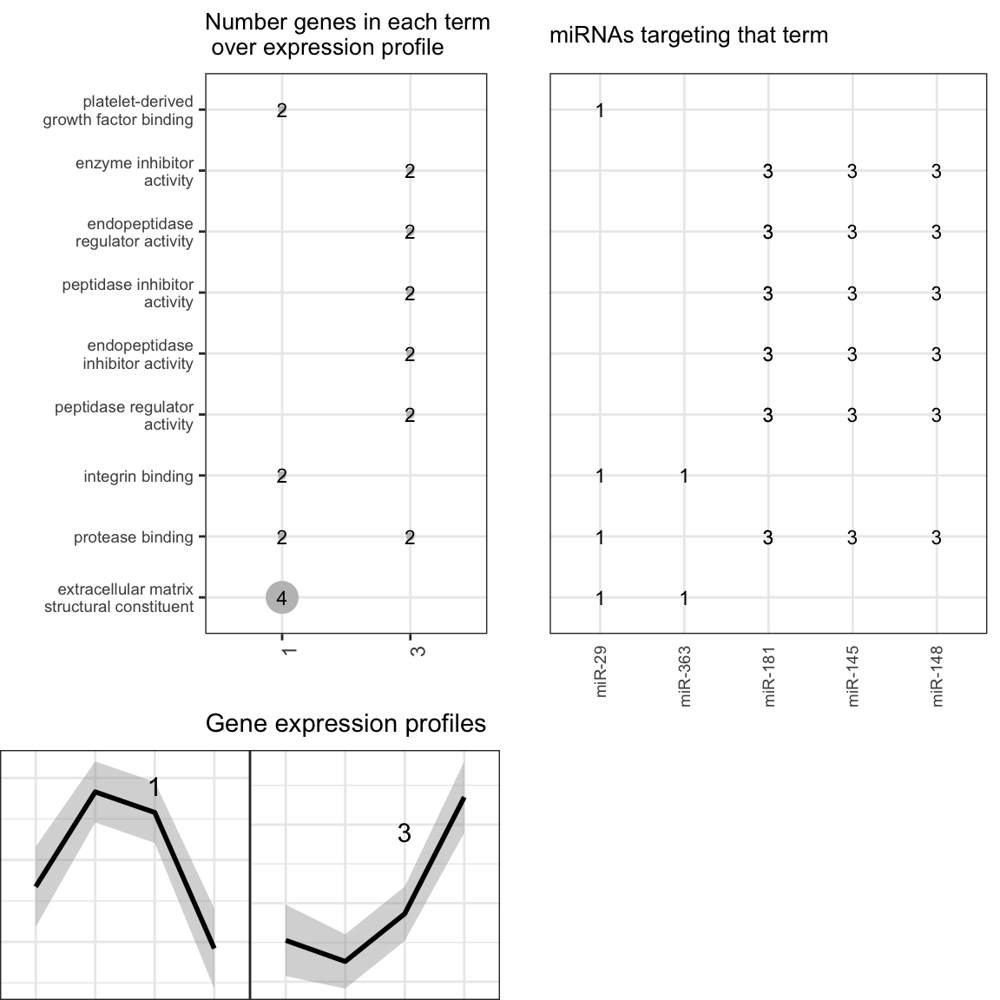

This post should show you an easy way to get the following data type
integrated into a figure:

-   functional enricment analysis
-   gene expression data from any technology
-   miRNA expression data from any technology

I am using the function `isoNetwork` from the package `isomiRs`, that of
course is developed by me :) My ego is not that big, it is just I wanted
a figure showing that information, and I couldn't find any at a time,
but if you know any, tweet me about it to @lopantano.

This function needs some pre-computed information, like the normalized
expression and the targeted genes by miRNAs. Normally, the significant
genes and miRNAs from a differentially expression analysis would do it.

The first requirement is two have these two datasets into a
SummarizedExperiment object As an example, I am using the published data
from Folic Acid Mouse model (GSE65267) that has been analyzed with
bcbio-nextgen pipeline and bcbioRNASeq pacakge.

I saved these analysis into an R object that contains:

-   fa\_mrna: gene expression
-   fa\_mirna: miRNA expression
-   fa\_cold: metadata

From that, I ran DESeq2 to get the significant genes and miRNAs from the
comparison day14 vs day0 (normal).

    R> load("fa_isonetwork.rda")
    R> library(isomiRs)
    R> library(DESeq2)
    R> library(SummarizedExperiment)
    R> 
    R> mi_cold = fa_cold[colnames(fa_mirna), , drop = F]
    R> mi_dse = DESeqDataSetFromMatrix(round(2^fa_mirna), mi_cold, design = ~day)
    R> mi_dse = DESeq(mi_dse)
    R> mi_res = results(mi_dse, name = "day_day14_vs_normal")
    R> mi_res = mi_res[!is.na(mi_res$padj), ]
    R> mi_top = row.names(mi_res[mi_res$padj < 0.05, ])
    R> mi_rse = SummarizedExperiment(assays = SimpleList(norm = fa_mirna), colData = mi_cold, 
    +     metadata = list(sign = mi_top))
    R> 
    R> m_cold = fa_cold[colnames(fa_mrna), , drop = F]
    R> m_dse = DESeqDataSetFromMatrix(round(2^fa_mrna), m_cold, design = ~day)
    R> m_dse = DESeq(m_dse)
    R> m_res = results(m_dse, name = "day_day14_vs_normal")
    R> m_res = m_res[!is.na(m_res$padj), ]
    R> m_top = row.names(m_res[m_res$padj < 0.05, ])
    R> m_rse = SummarizedExperiment(assays = SimpleList(norm = fa_mrna), colData = m_cold, 
    +     metadata = list(sign = m_top))

After that, I ran the functional analysis with [`clusterProfiler` Bioc
package](http://bioconductor.org/packages/release/bioc/html/clusterProfiler.html):

    R> library(org.Mm.eg.db)
    R> library(clusterProfiler)
    R> 
    R> 
    R> ego <- enrichGO(m_top, org.Mm.eg.db, "ENSEMBL", ont = "MF", universe = rownames(m_res))

Actually, it could be anything as far as the table have the same naming
that the one comming from this package.

Last step before the real integration analysis, is to get the predicted
targets of the miRNA. This can be done with any package as far as you
get a table with two columns: gene and mirna.

I used two options, one using the already implemented code in the
package (that uses targetscan database):

    R> library(targetscan.Mm.eg.db)
    R> m2t = mirna2targetscan(mi_top, species = "mmu", org = org.Mm.eg.db, keytype = "ENSEMBL")
    R> 
    R> mirna_targets = findTargets(mi_rse, m_rse, m2t[, c("ENSEMBL", "mir")], summarize = "day", 
    +     min_cor = -0.7)

    ## Dimmension of cor matrix: 49 5233

or using the function `get_multimir` implemented on [`multiMiR` Bioc
package](http://bioconductor.org/packages/release/bioc/html/multiMir.html).

    R> library(multiMiR)
    R> multimir_results <- get_multimir(org = "mmu", mirna = mi_top, table = "validated", 
    +     summary = TRUE)
    R> 
    R> library(magrittr)
    R> m2t_multimir = slot(multimir_results, "data")[, c("target_ensembl", "mature_mirna_id")] %>% 
    +     dplyr::filter(target_ensembl != "") %>% dplyr::distinct()
    R> 
    R> mirna_targets = findTargets(mi_rse, m_rse, m2t_multimir, summarize = "day", 
    +     min_cor = -0.7)

In both cases, I ran `findTargets` to use the expression data to make
sure the correlation between the miRNA and predicted gene is negative
since is the known biological function of miRNAs, being negative
modulators.

Finally, we use `isoNetwork` to put all the data together, and
`isoPlotNet` to create the final figure with all information.

    R> data <- isoNetwork(mi_rse, m_rse, min_fc = 0.1, summarize = "day", target = mirna_targets, 
    +     enrich = ego)

    ## Dimmension of cor matrix: 49 305

    R> isoPlotNet(data, minGenes = 1)

It is an easy way to spot what pathways contain genes that are targeted
by miRNAs.

Note that this function won't indicate if a pathway is enriched on miRNA
targets. It shows how these three different data set can be put together
to explore the relationship among them.

------------------------------------------------------------------------

> "self-control in bioinformatics: be nice to your collaborator when
> they can not open a TSV file with excel."
