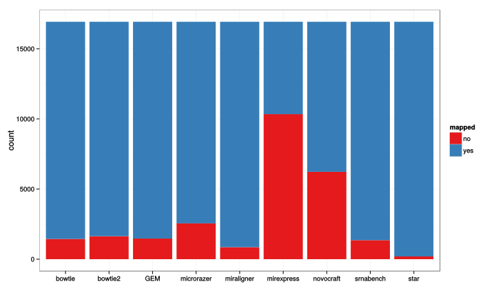
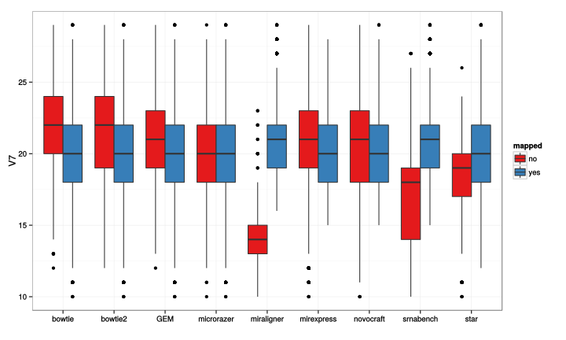
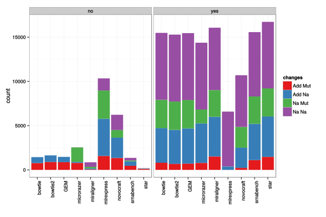
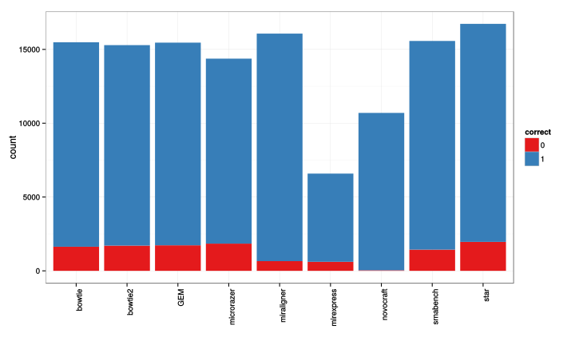

```r
library(knitr)
library(rmarkdown)
library(knitrBootstrap)

opts_chunk$set(tidy = TRUE, highlight = T, figalign = "center", cache = T, fig.height = 6, 
    fig.width = 10, message = F, error = F, warning = F, bootstrap.show.code = FALSE)
```


```r
data <- read.table("stats", skip = 1)
data$V2 <- as.character(data$V2)
data$V4 <- as.character(data$V4)
data$V5 <- data$V5/abs(data$V5)
data$V5[data$V5 == 1] <- "Na"
data$V5[data$V5 == -1] <- "Add"
data$V6 <- data$V6/abs(data$V6)
data$V6[data$V6 == 1] <- "Na"
data$V6[data$V6 == -1] <- "Mut"
data$changes <- paste(data$V5, data$V6)
data$TP <- apply(data[, c(2, 4)], 1, function(x) {
    v <- grep(x[1], x[2], ignore.case = T)
    if (length(v) == 0) {
        v <- 0
    }
    return(v)
})
```

# Mapped
Proportion of mapped and no-mapped sequences

```r
library(ggplot2)
ggplot(data, aes(V8, fill = V3)) + geom_bar() + theme_bw() + labs(x = "") + 
    scale_fill_brewer("mapped", palette = "Set1")
```

 


# Size effect
How size affects the alignments

```r
ggplot(data, aes(V8, V7, fill = V3)) + geom_boxplot() + theme_bw() + labs(x = "") + 
    scale_fill_brewer("mapped", palette = "Set1")
```

 

# Isomirs effect
How changes affect the alignment

```r
ggplot(data, aes(V8, fill = changes)) + geom_bar() + theme_bw() + labs(x = "") + 
    facet_wrap(~V3) + scale_fill_brewer("changes", palette = "Set1") + theme(axis.text.x = element_text(angle = 90, 
    hjust = 1))
```

 


# Specificity
How many were assigned to only the correct miRNA. Normally miRNA can map to other miRNAs that are from the same family. "Red" will be sequences mapping to multiple miRNAs.

```r
ggplot(data[data$V3 == "yes", ], aes(V8, fill = factor(TP))) + geom_bar() + 
    theme_bw() + labs(x = "") + scale_fill_brewer("correct", palette = "Set1") + 
    theme(axis.text.x = element_text(angle = 90, hjust = 1))
```

 


