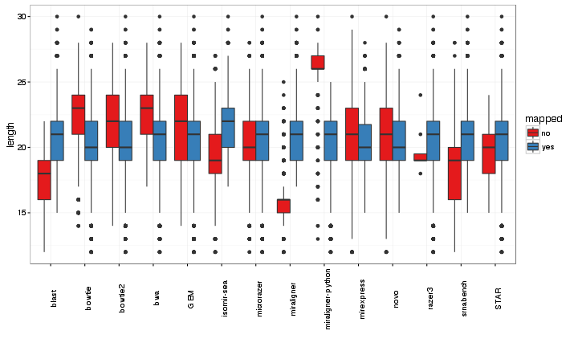

```r
> library(knitr)
> library(rmarkdown)
> library(knitrBootstrap)
> options(bitmapType = "cairo")
> opts_chunk$set(tidy = TRUE, highlight = T, figalign = "center", fig.height = 6, 
+     fig.width = 10, message = F, error = F, warning = F, bootstrap.show.code = FALSE)
```

# Method

 * scoring: in case the tool gives a score, the best score will be used. If not the first hit is the one used. If score is the same, the first hit is used. Tools that can be scored are: bowtie, bowtie2, chimira_blast, GEM, microzer, miraligner, miraligner-python, novoaling, razer3, STAR
 * only miraligner* and srnabench gives miRNA annotation, so these tools should have an advantage since they are parsing the hits to get the best annotation Anyway, I am trying to get the best of all of them when comparing which annotates better using precursor names.
 

```r
> data <- read.table("stats", skip = 1)
> data$V2 <- as.character(data$V2)
> data$V4 <- as.character(data$V4)
> data$V5 <- data$V5/abs(data$V5)
> data$V5[data$V5 == 1] <- "Na"
> data$V5[data$V5 == -1] <- "Add"
> data$V6 <- data$V6/abs(data$V6)
> data$V6[data$V6 == 1] <- "Na"
> data$V6[data$V6 == -1] <- "Mut"
> data$changes <- paste(data$V5, data$V6)
> data$TP <- apply(data[, c(2, 4)], 1, function(x) {
+     v <- grep(x[1], x[2], ignore.case = T)
+     if (length(v) == 0) {
+         v <- 0
+     }
+     return(v)
+ })
> data$TPmirna <- apply(data[, c(2, 4)], 1, function(x) {
+     h1 = unlist(strsplit(x[1], split = "-"))[1:3]
+     h2 = unlist(strsplit(x[2], split = "-"))[1:3]
+     v <- grep(paste0(h1, collapse = "-"), paste0(h2, collapse = "-"), ignore.case = T)
+     if (length(v) == 0) {
+         v <- 0
+     }
+     return(v)
+ })
```

# Mapped
Proportion of mapped and no-mapped sequences

```r
> library(ggplot2)
> library(dplyr)
> dt = data %>% group_by(V8, V3) %>% summarise(total = n()) %>% as_data_frame()
> ggplot(dt, aes(x = V8, y = total, fill = V3)) + geom_bar(stat = "identity") + 
+     geom_text(aes(label = total), vjust = -1) + theme_bw() + labs(x = "") + 
+     ylim(0, max(dt$total) + 2000) + scale_fill_brewer("mapped", palette = "Set1") + 
+     facet_wrap(~V3, scales = "free_y", ncol = 1) + theme(axis.text.x = element_text(angle = 90))
```

 


# Size effect
How size affects the alignments

```r
> ggplot(data, aes(V8, V7, fill = V3)) + geom_boxplot() + theme_bw() + labs(x = "") + 
+     scale_fill_brewer("mapped", palette = "Set1")
```

 

# Isomirs effect
How changes in the mature miRNA affect the alignment

```r
> ggplot(data, aes(V8, fill = changes)) + geom_bar() + theme_bw() + labs(x = "") + 
+     facet_wrap(~V3) + scale_fill_brewer("changes", palette = "Set1") + theme(axis.text.x = element_text(angle = 90))
```

 


# Specificity at precursor level
How many were assigned to the correct miRNA using the precursor name as the true positive.
Red would be "not correct" and blue "correct". This is only considering mapped sequences.

```r
> dt = data %>% filter(V3 == "yes") %>% group_by(V8, TP) %>% summarise(total = n()) %>% 
+     as_data_frame()
> ggplot(dt, aes(x = V8, y = total, fill = factor(TP))) + geom_bar(stat = "identity") + 
+     geom_text(aes(label = total), vjust = -1, size = 3) + theme_bw() + labs(x = "") + 
+     ylim(0, max(dt$total) + 200) + scale_fill_brewer(guide = FALSE, "correct", 
+     palette = "Set1") + theme(axis.text.x = element_text(angle = 90)) + facet_wrap(~TP, 
+     scales = "free_y") + ggtitle("Specificity at precursor level")
```

 


# Specificity at miRNA level
Same logic than before but with the miRNA names in case the tool gives the miRNA names, if not, only the three first field in the name are used as annotation (i.e hsa-let-7a-1 will ignore any character beyond 7a). This will increase the number of TP, since many miRNAs has multiple precursors being the same mature miRNA at the end.

```r
> dt = data %>% filter(V3 == "yes") %>% group_by(V8, TPmirna) %>% summarise(total = n()) %>% 
+     as_data_frame()
> ggplot(dt, aes(x = V8, y = total, fill = factor(TPmirna))) + geom_bar(stat = "identity") + 
+     geom_text(aes(label = total), vjust = -1, size = 3) + theme_bw() + labs(x = "") + 
+     ylim(0, max(dt$total) + 200) + scale_fill_brewer(guide = FALSE, "correct", 
+     palette = "Set1") + theme(axis.text.x = element_text(angle = 90)) + facet_wrap(~TPmirna, 
+     scales = "free_y") + ggtitle("Specificity at mature miRNA level")
```

 

