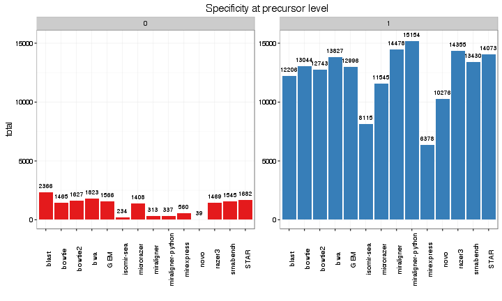
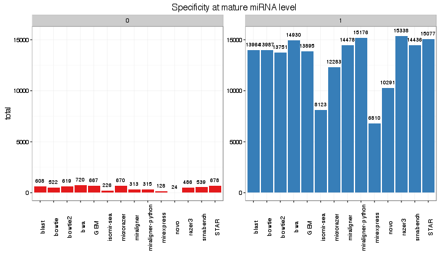

```r
> library(knitr)
> library(rmarkdown)
> library(knitrBootstrap)
> options(bitmapType = "cairo")
> opts_chunk$set(tidy = TRUE, highlight = T, figalign = "center", fig.height = 6, 
+     fig.width = 10, message = F, error = F, warning = F, bootstrap.show.code = FALSE)
```


```r
> data <- read.table("stats", skip = 1)
> data$V2 <- as.character(data$V2)
> data$V4 <- as.character(data$V4)
> data$V5 <- data$V5/abs(data$V5)
> data$V5[data$V5 == 1] <- "Na"
> data$V5[data$V5 == -1] <- "Add"
> data$V6 <- data$V6/abs(data$V6)
> data$V6[data$V6 == 1] <- "Na"
> data$V6[data$V6 == -1] <- "Mut"
> data$changes <- paste(data$V5, data$V6)
> data$TP <- apply(data[, c(2, 4)], 1, function(x) {
+     v <- grep(x[1], x[2], ignore.case = T)
+     if (length(v) == 0) {
+         v <- 0
+     }
+     return(v)
+ })
> data$TPmirna <- apply(data[, c(2, 4)], 1, function(x) {
+     h1 = unlist(strsplit(x[1], split = "-"))[1:3]
+     h2 = unlist(strsplit(x[2], split = "-"))[1:3]
+     v <- grep(paste0(h1, collapse = "-"), paste0(h2, collapse = "-"), ignore.case = T)
+     if (length(v) == 0) {
+         v <- 0
+     }
+     return(v)
+ })
```

# Mapped
Proportion of mapped and no-mapped sequences

```r
> library(ggplot2)
> library(dplyr)
> dt = data %>% group_by(V8, V3) %>% summarise(total = n()) %>% as_data_frame()
> ggplot(dt, aes(x = V8, y = total, fill = V3)) + geom_bar(stat = "identity") + 
+     geom_text(aes(label = total), vjust = -1) + theme_bw() + labs(x = "") + 
+     ylim(0, max(dt$total) + 2000) + scale_fill_brewer("mapped", palette = "Set1") + 
+     facet_wrap(~V3, scales = "free_y", ncol = 1) + theme(axis.text.x = element_text(angle = 90))
```

 


# Size effect
How size affects the alignments

```r
> ggplot(data, aes(V8, V7, fill = V3)) + geom_boxplot() + theme_bw() + labs(x = "") + 
+     scale_fill_brewer("mapped", palette = "Set1")
```

 

# Isomirs effect
How changes affect the alignment

```r
> ggplot(data, aes(V8, fill = changes)) + geom_bar() + theme_bw() + labs(x = "") + 
+     facet_wrap(~V3) + scale_fill_brewer("changes", palette = "Set1") + theme(axis.text.x = element_text(angle = 90))
```

 


# Specificity at precursor level
How many were assigned to only the correct miRNA. Normally miRNA can map to other miRNAs that are from the same family/precursor. "Red" will be sequences mapping to multiple miRNAs.

```r
> dt = data %>% filter(V3 == "yes") %>% group_by(V8, TP) %>% summarise(total = n()) %>% 
+     as_data_frame()
> ggplot(dt, aes(x = V8, y = total, fill = factor(TP))) + geom_bar(stat = "identity") + 
+     geom_text(aes(label = total), vjust = -1, size = 3) + theme_bw() + labs(x = "") + 
+     ylim(0, max(dt$total) + 200) + scale_fill_brewer(guide = FALSE, "correct", 
+     palette = "Set1") + theme(axis.text.x = element_text(angle = 90)) + facet_wrap(~TP, 
+     scales = "free_y")
```

 


# Specificity at miRNA level


```r
> dt = data %>% filter(V3 == "yes") %>% group_by(V8, TPmirna) %>% summarise(total = n()) %>% 
+     as_data_frame()
> ggplot(dt, aes(x = V8, y = total, fill = factor(TPmirna))) + geom_bar(stat = "identity") + 
+     geom_text(aes(label = total), vjust = -1, size = 3) + theme_bw() + labs(x = "") + 
+     ylim(0, max(dt$total) + 200) + scale_fill_brewer(guide = FALSE, "correct", 
+     palette = "Set1") + theme(axis.text.x = element_text(angle = 90)) + facet_wrap(~TPmirna, 
+     scales = "free_y")
```

 

