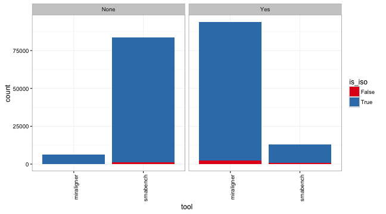
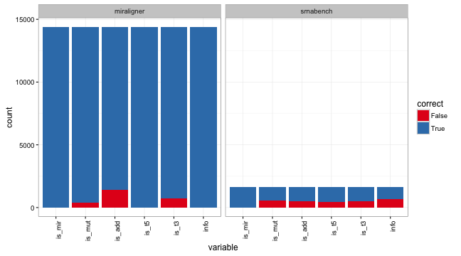

```r
data <- read.table("stats_isomirs_full", header = T)
```

# Overview

The idea of this report is to show how well miraligner and srnabench are decting
isomiRs. I simulated a bunch of isomirs (16000) that can have the folowing variation:

* starts at different position than the reference miRNA: t5
* ends at different position than the reference miRNA: t3
* have a mutation: muts
* have nt addition at the end: add


I used the file `miRBase_isoAnnotation.txt` from srnabench results. This file only have
1332 sequences, so I don't know what happened with the rest, but it is the only
file I found with this information.

# Detection 

Correct isomir annotation for miraligner and srnabench.


```r
library(ggplot2)
library(reshape)
data_gg <- melt(data, id.vars = c("name", "is_iso", "tool", "find"))
ggplot(data_gg, aes(tool, fill = is_iso)) + geom_bar() + scale_fill_brewer(palette = "Set1") + 
    theme_bw() + facet_wrap("find") + theme(axis.text.x = element_text(angle = 90, 
    hjust = 1))
```




#Accuracy

* `is_mir` is True when the isomiR is annotated to the correct miRNA
* `info` is True when the information of the changes are reported, is False
when there are multiple changes but there is no annotation of the exactly variations.
This happens because srnabench flag as `mv` when the sequence has variations at
both sides.


```r
data_gg_ann <- melt(subset(data, is_mir == "True"), id.vars = c("name", "is_iso", 
    "tool", "find"))
ggplot(subset(data_gg_ann, is_iso == "True" & find == "Yes"), aes(variable, 
    fill = value)) + geom_bar() + theme_bw() + scale_fill_brewer("correct", 
    palette = "Set1") + facet_wrap(~tool) + theme(axis.text.x = element_text(angle = 90, 
    hjust = 1))
```



